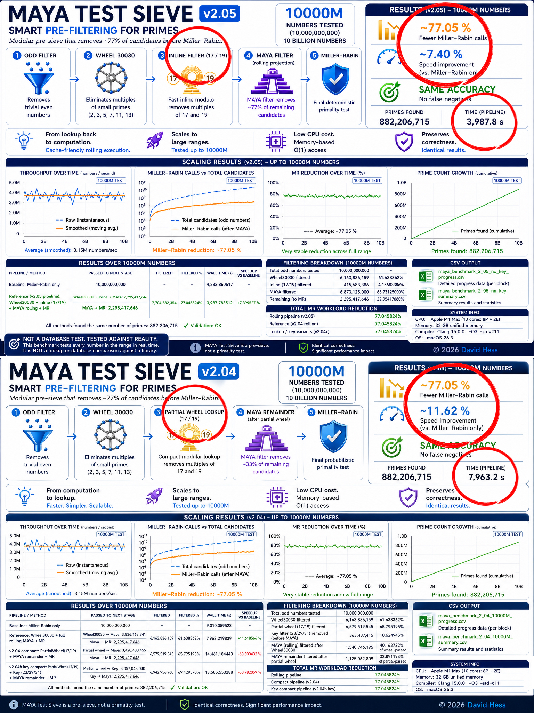

# MAYA Test Sieve v2.05

**Smart pre-filtering for prime testing**

MAYA Test Sieve is a modular pre-sieve designed to reduce the number of candidates passed to expensive primality tests such as Miller–Rabin.


v2.05 reduced pipeline runtime from 7963 s to 3988 s while preserving identical filtering behavior and ~77% Miller–Rabin workload reduction.
---

## 🔬 Core Idea

Instead of testing all odd numbers directly:

```text
odd numbers → Miller–Rabin

MAYA introduces a structured filtering pipeline:

* Odd filter
* Wheel30030 (2, 3, 5, 7, 11, 13)
* Inline rolling filter (17 / 19)
* MAYA positional filter (residue-based projection)
* Miller–Rabin

---

## 🚀 Results (10B numbers)

- **Numbers tested:** 10,000,000,000  
- **Primes found:** 882,206,715  
- **Validation:** ✔ identical across all methods  

### Performance

| Method | Time | Speed vs baseline |
|---|---|---|
| Baseline (MR only) | 4282 s | — |
| Rolling MAYA v2.05 | 3988 s | +7.40% |

---

## 📉 Miller–Rabin Workload Reduction

All MAYA variants achieved:

~77.05% reduction in MR calls

This demonstrates:

* filtering quality remains stable across implementations
* runtime performance depends heavily on execution strategy
* cache locality is critical for large-scale filtering

---

## ⚙️ Main Changes in v2.05

Version 2.05 replaces the lookup-based partial wheel system from v2.04 with a lightweight inline rolling filter (17 / 19).

### v2.04
* lookup / compact modular filtering
* higher memory access overhead
* increased cache pressure
* more branching operations

### v2.05
* inline rolling filtering
* lower memory overhead
* improved cache locality
* simpler execution flow
* nearly 2× faster runtime

The mathematical filtering behavior remains identical, but the execution strategy is significantly more efficient.

---

## 🧩 Original MAYA Principle

MAYA does not rely on direct division.

Instead, it uses:

* positional decomposition (base-20 inspired)
* projection coefficients
* residue matrices

This enables detection of composite numbers via structured arithmetic rather than repeated modulo division.

---

## 📊 Why v2.04 matters

Even though v2.04 is slower:

- ✔ proves correctness of compact representation  
- ✔ preserves identical filtering behavior  
- ✔ validates modular / lookup-based approach  
- ✔ separates **algorithmic idea vs implementation strategy**

---

## 🚀 Why v2.05 matters

v2.05 demonstrates that execution strategy matters as much as mathematical filtering quality.

The transition from lookup-based filtering to inline rolling filtering preserved:

* identical reduction ratio
* identical prime counts
* identical filtering behavior

while reducing runtime from:

7963 s → 3988 s

This confirms that:

* cache locality
* reduced memory pressure
* lower branching overhead

are critical factors in large-scale prime filtering pipelines.

---
## 🔄 Next Steps

* Hybrid rolling + selective lookup pipeline
* SIMD / vectorization
* hardware-aware optimizations
* multidimensional spatial mapping experiments
* computational geometry filtering approaches

---
## 📁 Data

v2.04

* data/2.04/maya_benchmark_2_04_10000M_progress.csv
* data/2.04/maya_benchmark_2_04_10000M_summary.csv

v2.05
* data/2.05/maya_benchmark_2_05_no_key_cache_rolling_progress.csv
* data/2.05/maya_benchmark_2_05_no_key_cache_rolling_summary.csv

## ⚠️ Note

MAYA Test Sieve is a pre-filter, not a primality test.
Final correctness always depends on Miller–Rabin (or equivalent).

---

## 🧠 Conclusion

MAYA Test Sieve demonstrates that structured residue-based pre-filtering can significantly reduce the workload of probabilistic primality tests without affecting correctness.

The experiments on a 10B range confirm that:

* large-scale candidate reduction (~77%) is achievable
* filtering behavior remains stable across implementations
* execution strategy has major impact on runtime performance

The MAYA approach opens a path toward hybrid and hardware-aware filtering systems optimized for large-scale prime testing.

---

## 👤 Author

David Hess  
2026
