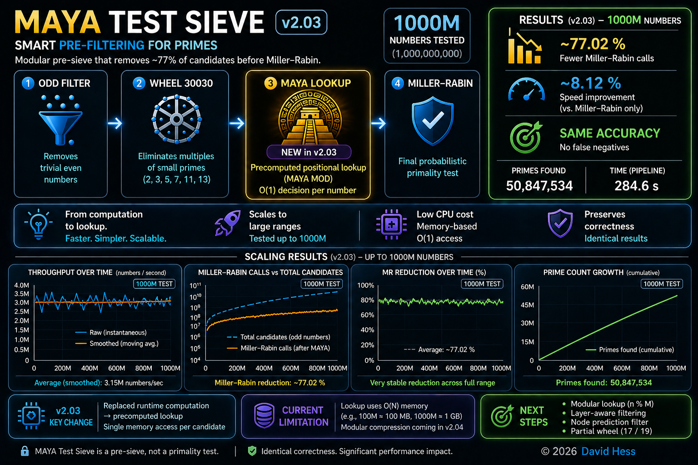

# MAYA Prime Sieve

---

## Overview

MAYA Prime Sieve is a modular pre-filter designed to reduce the number of candidates passed to computationally expensive primality tests such as Miller–Rabin.

The method is based on positional decomposition and acts as an optimization layer, not a standalone primality test.

---

## Pipeline

odd numbers
→ Wheel30030
→ MAYA (lookup)
→ Miller–Rabin

---

Key Idea (v2.03)

The main improvement in version 2.03:

runtime computation → precomputed lookup

---

## Previous form:

pass(n) = Wheel(n) && Maya(n)

---

## Current form:

pass(n) = LOOKUP(index(n))

---

## This reduces decision cost to:

O(1) per number

---

## Results
## 1000M Test

* ~77% fewer Miller–Rabin calls
* ~8% speed improvement vs baseline
* identical results (0 false negatives)

---

## Performance Graphs

## Throughput (raw vs smoothed)

Candidate reduction (MAYA vs Miller–Rabin)

---

## Interpretation

* Filtering power remains stable (~77%)
* Lookup removes the main computational bottleneck
* Performance improves with scale

---

## Scaling

Range         Result
10M           ✔ faster
100M          ✔ stable
1000M         ✔ scalable

---

## Evolution

## v1.00

* ~77% MR reduction
* small speedup (~1–2%)
* limitation: high per-candidate cost

## v2.02

* improved rolling computation
* still CPU-bound

## v2.03

* lookup-based filtering
* filter cost reduced below Miller–Rabin
* confirmed scalability

---

## Current Limitation

The current implementation uses:

O(N) memory

---

## This is not the final architecture.

## Next Steps (v2.04)

Planned improvements:

* modular lookup compression (n % M)
* layer-aware filtering
* node-based elimination
* partial wheel reinforcement (17 / 19)

---

## Design Philosophy

* minimize runtime computation
* move complexity to precomputation
* preserve correctness strictly
* optimize for large-scale inputs

---

## Purpose

MAYA Prime Sieve is intended as:

a pre-sieve optimization layer for primality testing pipelines

---

## Disclaimer

This is not a primality test.
It does not prove primality.

---

## Status

Active research.
Next milestone: v2.04

---

## Citation

DOI: https://doi.org/10.5281/zenodo.19807084

---

## Overview

---

## Author

David Hess
© 2026 

